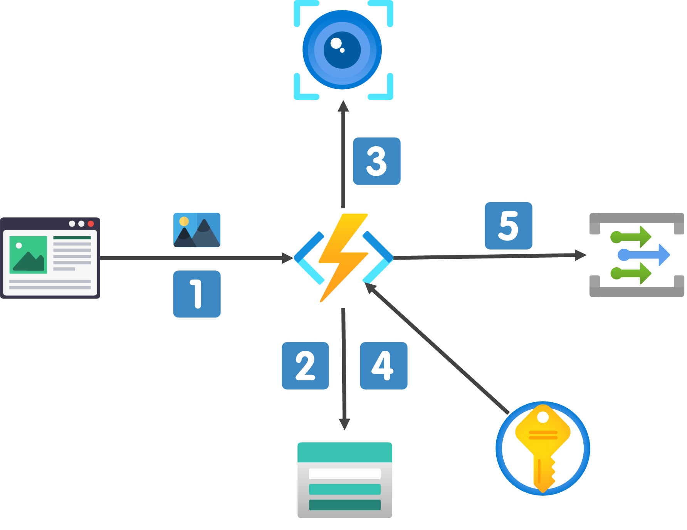
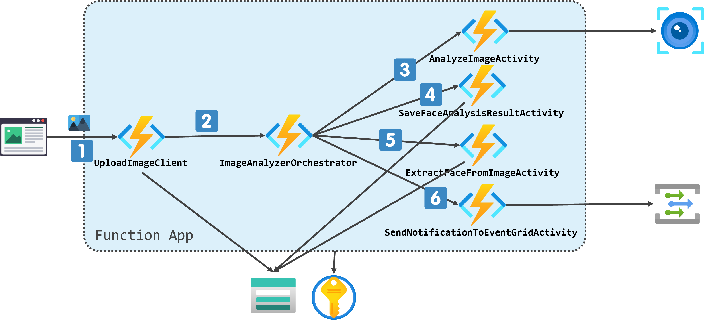
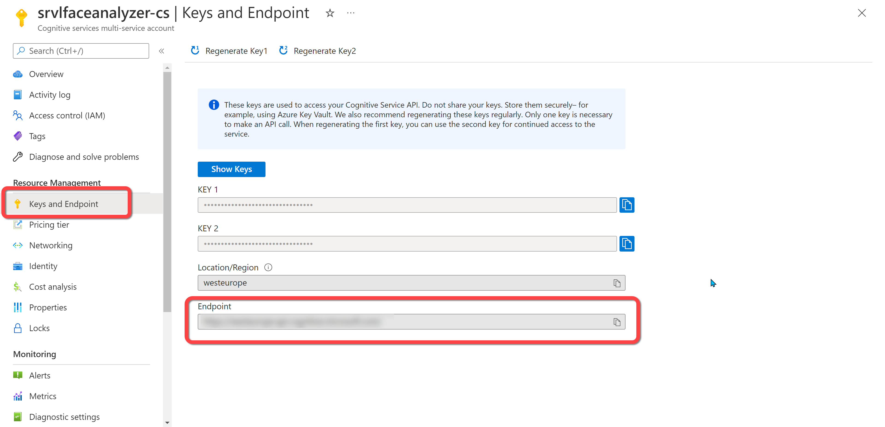
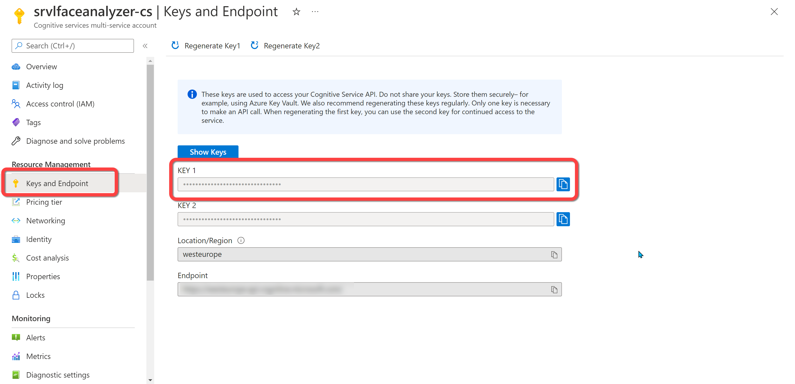
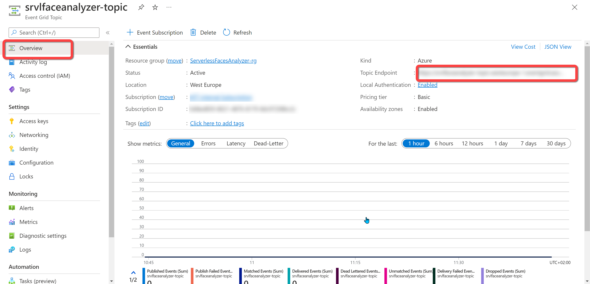
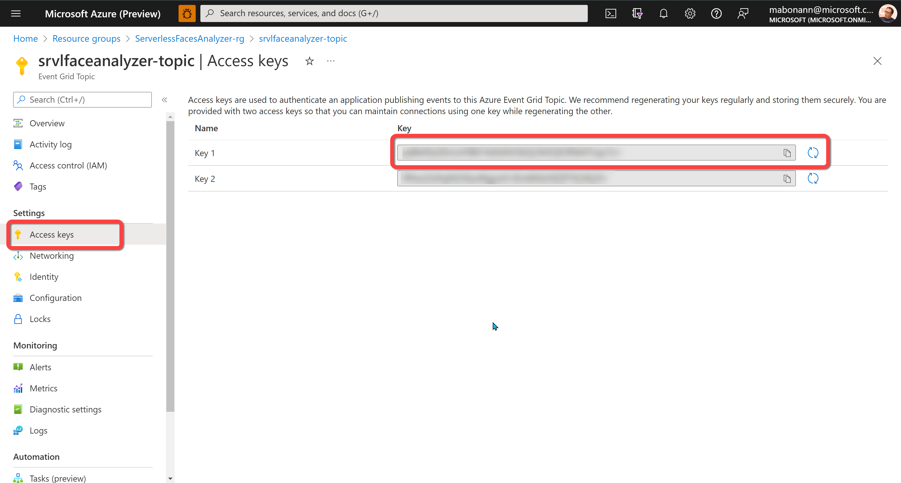

# Serverless Faces Analyzer

This project is a simple implementation of a Serverless solution for image analysis.

The solution allows user to upload an image using a HTTP call (POST multi-part), analyzes the image to look for faces, and for every face founded in the image, the solution extracts the face from the original image and creates an image into a storage account. 

In this project, you can find two different implementations of the same solution: one using Azure Functions and the other using Durable Functions

## Azure Functions
This implementation uses one single Azure Functions to execute all the tasks.



1. The image is submitted through a POST HTTP call;
2. The function uploads the image on a specific folder in the Storage Account. The function generates an operation id (GUID) and uses it to create a folder in the storage account. The folder contains the year, month and day (and the operation id) when the image is submitted;
3. The function calls Image Analysis Service (more info <a href="https://docs.microsoft.com/en-us/azure/cognitive-services/computer-vision/overview-image-analysis" target="_blank">here</a>) to analyze the image;
4. The function uploads the result of the analysis into the Storage Account, and if there are faces, extracts the faces from the original image and uploads them on the Storage;
5. The function publishes an event using an Event grid Topic to communicate with external system

All the sensitive information (like connection strings, service keys and so on) are stored in a Key Vault.

## Durable Functions
This implementation uses a workflow based on Durable Functions to analyze the image.



1. The image is submitted through a POST HTTP call. The `UploadImageClient` functions (it is a client function), checks if the request is valid, uploads the image into the storage account;
2. The client starts a new orchestration (the id of the orchestration is the operation id of the analysis). The orchestrator calls 4 different activities to execute all the tasks for the analysis;
3. The `AnalyzeImageActivity` calls Image Analysis Service (more info <a href="https://docs.microsoft.com/en-us/azure/cognitive-services/computer-vision/overview-image-analysis" target="_blank">here</a>) to analyze the image and return the result to the orchestrator;
4. The `SaveFaceAnalysisResultActivity` creates a blob that contain the JSON of the analysis result;
5. For each face in the result (if there are faces in the image), the orchestrator calls the `ExtractFaceFromImageActivity` function (one call for each face) to extract the face from the image;
6. The `SendNotificationToEventGridActivity` send an event to the Event Grid Custom Topic to allow communication to other services.

All the sensitive information (like connection strings, service keys and so on) are stored in a Key Vault.

## Configuration
This is the `setting.json` file for the configuration:

```json
{
  "IsEncrypted": false,
  "Values": {
    ....
    "StorageConnectionString": "",
    "DestinationContainer": "faces",
    "FaceAnalyzer:ServiceEndpoint": "",
    "FaceAnalyzer:ServiceKey": "",
    "FaceAnalyzer:AgeThreshold": "18",
    "TopicEndpoint": "",
    "TopicKey": ""
  }
}
```

* `StorageConnectionString` : This is the connection string of the storage where the images and the analysis results will be uploaded. This value must be a reference to a secret in the KeyVault. 
* `DestinationContainer` : This is the container in the storage account where the images and the analysis results will be uploaded. You can use `faces` or a valid container name.
* `FaceAnalyzer:ServiceEndpoint` : This is the endpoint of the Cognitive Service resource you use to analyze the source image.  This value must be a reference to a secret in the KeyVault. You can find this value in the Cognitive Service resource blade in the Azure Portal as shown in the following figure:



* `FaceAnalyzer:ServiceKey` : This is one of the access keys of the Cognitive Service resource you use to analyze the source image. This value must be a reference to a secret in the KeyVault. You can find this value in the Cognitive Service resource blade in the Azure Portal as shown in the following figure:



* `FaceAnalyzer:AgeThreshold` : This is the age threshold used by the solution to filter the faces in the source image. The solution extract only the faces that have an age greater or equal to the threshold you set in the configuration. If you set the value 0, all the faces will be extracted.

* `TopicEndpoint` : This is the endpoint of the custom topic that the solution uses to emits event for the external services. This value must be a reference to a secret in the KeyVault. You can find this value in the Event Grid Topic resource blade in the Azure Portal as shown in the following figure:



* `TopicKey` : This is one of the access keys of the custom topic that the solution uses to emits event for the external services. This value must be a reference to a secret in the KeyVault. You can find this value in the Event Grid Topic resource blade in the Azure Portal as shown in the following figure:

